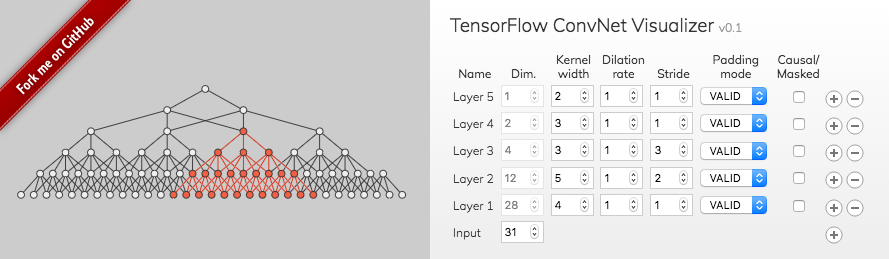

ConvNet Visualizer
==================

Link to web app with WaveNet example: [https://rdinse.github.com/convnet-visualizer/convnet-visualizer.html](http://rdinse.github.io/convnet-visualizer/convnet-visualizer.html#27~0,27,3,8,1,1,1~0,27,3,4,1,1,1~0,27,3,2,1,1,1~0,27,3,1,1,1,1)

This is a web app for visualizing the network structure of convolutional neural networks. By clicking on the neurons one can highlight the receptive and projective fields. The network can be exported as SVG image and shared as URL.

### References and Resources

* [A guide to receptive field arithmetic for Convolutional Neural Networks](https://medium.com/@nikasa1889/a-guide-to-receptive-field-arithmetic-for-convolutional-neural-networks-e0f514068807) by Dang Ha The Hien (2017)
* [What are the Receptive, Effective Receptive, and Projective Fields of Neurons in Convolutional Neural Networks?](https://arxiv.org/abs/1705.07049) by Hung Le and Ali Borji (2017)
* [A guide to convolution arithmetic for deep learning](https://arxiv.org/abs/1603.07285) by Vincent Dumoulin and Francesco Visin (2016)
* [TensorFlow Convolution Guide](https://www.tensorflow.org/api_guides/python/nn#Convolution)
